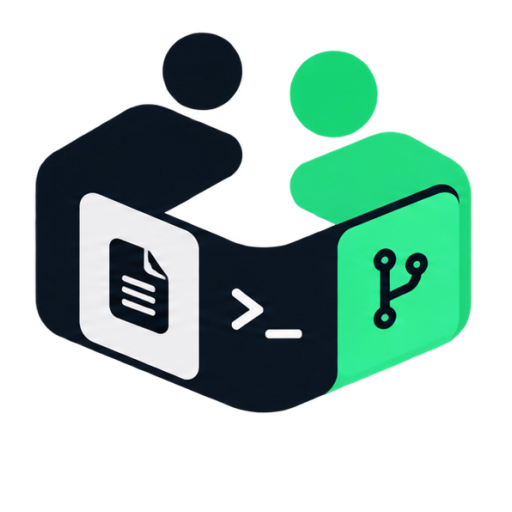

<p align="center"></p>

<h1 align="center">Coworker</h1>

<p align="center">A Windows desktop workspace for using ChatGPT with local projects through the Model Context Protocol (MCP).</p>

<p align="center"><a href="https://ws-coworker.netlify.app/">Coworker website</a> · <a href="https://ws-coworkerapi.netlify.app/">CoworkerAPI endpoint gateway</a></p>

Work with files, Git, and terminal commands in a task-focused interface, with visibility into tool activity and control over what runs.

## What you can do

- Organize projects into workspaces and tasks, with separate permissions and activity for each task.
- Review file changes, Git status, terminal output, and pending approvals in one place.
- Choose between Ask first, Automatic, and Full access modes for tool operations.
- Keep multiple ChatGPT profiles signed in separately and switch between them without reloading their sessions.
- Connect ChatGPT through a local MCP server and, when needed, a Secure MCP Tunnel.

## Get started

Coworker supports Windows 10/11 on x64. Download the installer from the [latest release](https://github.com/dat-hoangnguyentuandat/coworker/releases/latest). Connecting ChatGPT requires an account with access to ChatGPT apps and MCP connections. A remote connection also requires OpenAI's `tunnel-client`.

1. Install and open Coworker, then add your project folder as a workspace.
2. Create a task and leave its access mode on **Ask first** while getting familiar with the tools.
3. Start MCP in **Connections**. Follow the in-app guide to configure a tunnel and connect the Coworker app in ChatGPT.
4. In a new ChatGPT conversation, select Coworker and try a small request, such as listing files in the selected workspace. Review any requested operation before approving it.

See the [installation guide](https://ws-coworker.netlify.app/docs/en.html?page=install) and [quickstart](https://ws-coworker.netlify.app/docs/en.html?page=quickstart) for the complete setup sequence. The app's **Guide** button walks through the same flow.

## Security model

Coworker restricts its file tools to the selected workspace and exposes MCP locally with a runtime bearer token. Approval modes control whether supported operations wait for confirmation. Terminal commands, however, run with your Windows user permissions: selecting a workspace does **not** sandbox the shell. Review commands before approving them, and never share Runtime API keys or bearer tokens.

Read the [security guide](https://ws-coworker.netlify.app/docs/en.html?page=security) for details.

## Run from source

Install Node.js and npm, then run:

```powershell
cd coworker-app
npm ci
npm start
```

To create a Windows installer, run `npm run dist:win` from `coworker-app/`. The desktop app lives in `coworker-app/electron/`, the website and user guides in `coworker-web/`, and engineering documentation in `docs/`.

## Documentation and support

- [Website](https://ws-coworker.netlify.app/)
- [CoworkerAPI — OpenAI-compatible and Anthropic-compatible gateway](https://ws-coworkerapi.netlify.app/)
- [User documentation](https://ws-coworker.netlify.app/docs/en.html)
- [Multiple profiles](https://ws-coworker.netlify.app/docs/en.html?page=profiles)
- [MCP and tunnels](https://ws-coworker.netlify.app/docs/en.html?page=tunnels)
- [Changelog](https://ws-coworker.netlify.app/docs/en.html?page=changelog)

Questions or feedback: [hoangdatlnbp@gmail.com](mailto:hoangdatlnbp@gmail.com).
